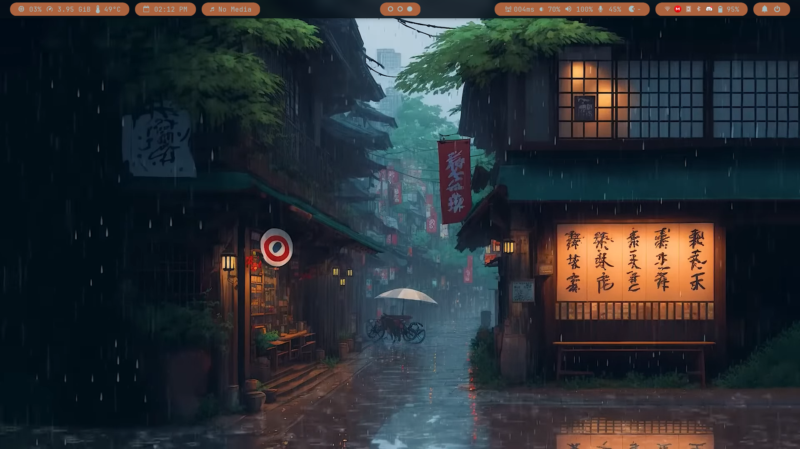

# Aesthetic Rain
An Aesthetic BSPWM Setup

<video width="100%" controls>
    <source src="../screenshots/aesthetic-rain.mp4" type="video/mp4">
</video>



## Installation
The following instructions are written for Arch Linux only.
1. Install the following packages using `yay` or `paru`
```bash
yay -S bspwm polybar-git rofi rofi-calc rofimoji rofi-greenclip sxhkd python-pywal wpgtk alacritty dunst mpv thunar nwg-look-bin zsh light acpi playerctl pamixer sddm-sugar-candy-git yad libnotify betterlockscreen imagemagick ffmpeg compfy maim optipng jq xwinwrap-0.9-bin git ttf-jetbrains-mono-nerd pipewire wireplumber
```
2. Clone this repository
```bash
git clone https://github.com/prayag2/dotfiles && cd dotfiles/aesthetic-rain
```
3. Copy the configs and make them executable
```bash
cp ./config/* ~/.config/
cp ./Xresources ~/.Xresources
cp ./zprofile ~/.zprofile
```
4. Copy scripts
```bash
mkdir -p ~/.local/bin
ln -s ~/.config/scripts/* ~/.local/bin/
chmod +x ~/.local/bin/*.sh
```
5. Copy wallpaper and generate pywal theme
```bash
mkdir -p ~/Videos
cp ./wallpaper/raining.mkv ~/Videos
~/.config/scripts/updatecolors.sh ~/Videos/raining.mkv

mkdir -p ~/.config/rofi
mkdir -p ~/.config/dunst
mkdir -p ~/.config/alacritty
ln -s ~/.cache/wal/rofi.rasi ~/.config/rofi/config.rasi
ln -s ~/.cache/wal/dunstrc ~/.config/dunst/
ln -s ~/.cache/wal/alacritty.yml ~/.config/alacritty/
```
6. Make bspwm config executable
```bash
chmod +x ~/.config/bspwm/bspwmrc
```
7. Reboot and log into BSPWM

Please open an issue if these commands don't work :)  
The wallpaper was taken by cropping this YouTube video: [Raining in Osaka](https://www.youtube.com/watch?v=MZhivjxcF-M)